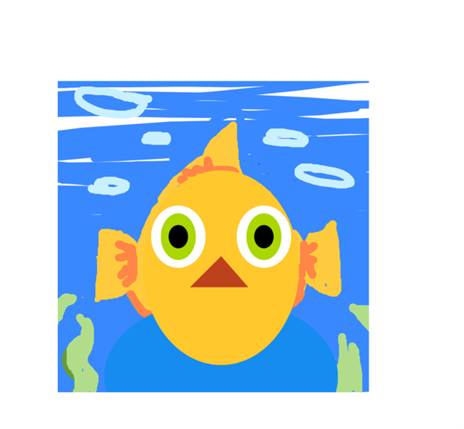

# Art Jam Response

I wrote these almost as personal messages to each person. So, when I say *you*, I mean the person who made the portrait (not you Pippin). I’m not sure if this is what I was supposed to do but creative liberties and all that.
Also I started writing this on Tuesday and I swear Aydan Mc Grail didn’t exist then. I have no idea why he’s on the list now but I actually did the three names below his. *(oops)*

*****

## Jordan Lobasso

[link to the portrait](https://lazer6769.github.io/Cart-253/Topics/art_jam/Art_Jam_Final/)

Love this so much!

I was very intrigued by the sliders when I first opened the page and it was a nice surprise that they let me modify the colours!!
I like how it also uncovers parts of the drawings it makes it engaging and gives a nice sense of surprise to the viewer. The initial self-portrait stares into your soul but then you add colour and it’s just a nice little guy!

I also really like the drawing aspect. A simple feature that adds so much interaction. Just think of all the hats I could give to this portrait. As an example, I turned you into a goldfish:

I also tried out the drawing function in different browsers and it was interesting to see how each browser had a different colour picker. Safari had some preset colours to choose from while edge had more of a colour wheel thing.

I looked at the code and I’m pleasantly surprised at how little code is needed to implement the ability to draw.
It’s such a great feature and feels super advanced but I see now that it’s fairly simple! Perhaps I will want to use this feature on a future portfolio website…
I also love the “clear drawing” button because it avoids having to refresh the page. It lets you save the sliders but restart on the drawing part!

*****

## Benedict Ambayec

[link to the portrait](https://benedict-cart2025.github.io/cart253/art-jam/index.html)

What a happy portrait!
The colours work well together, a very harmonious colour palette! ^^

Really great smile. I had such a hard time figuring out the smile for my portrait (and I’m still not fully satisfied with it) but using an arc is a great idea. I will jot that down for later.

But where’s my interaction? ;-;

I went snooping in the commits and I see that this may be a case of the procrastination…
GitHub really tells on you with the commit history, huh?

*****

## Chloé Guérin

[link to the portrait](https://chloe-jpeg.github.io/CART253/ART-JAM/self-portrait/)

I like how this portrait strongly represents you.
You added so many details, and it feels like every element in this portrait has a reason to be there and is a way of introducing yourself.

The code was actually super fun to read! All your comments made it feel like a story and like I was working on this project with you. It’s really nice how you put your personality not only on the canvas but also in the code! I feel like writing comments like these can also help you stay motivated throughout the project. It’s like talking to yourself. Actually quite helpful. Maybe I’ll start adding some more fun comments to my code too rather than simply boring descriptions. It helps understand what’s going on in your brain at the moment of writing the code.

The page wouldn’t load in my browser, but the READ ME file was very complete so I was still able to experience your portrait. I also went snooping in your assets to listen to the song.

*****

## Overall reflection

As someone who has experience in coding and who has also had a JavaScript class way back, I’m impressed by the portraits people were able to create. As a first project, this is wayyy beyond anything I could have done when first learning JavaScript.

It’s also nice to see how coding can be used in fun and creative ways. You kinda forget that after your third bank application project in computer science…
