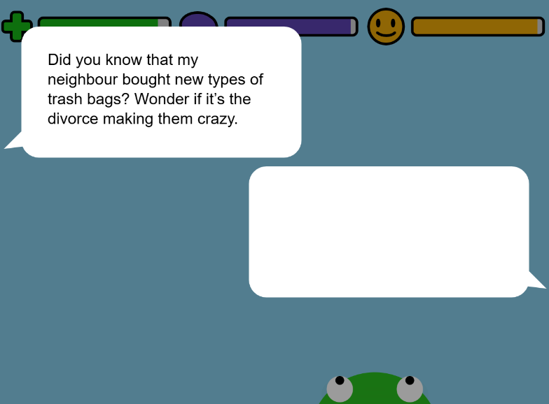

# FrogFrogFrog : The Quest for Immortality

Arielle Wong

[View this project online](https://wonarii.github.io/cart253/mod-jam/)

## Description

This is a modification of the game [FrogFrogFrog](https://pippinbarr.com/frogfrogfrog/).

In this version, Frog is attempting to avoid death by achieving immortality.
To do so, Frog must balance health, wisdom and happiness by eating well, exercising their mind and chatting with friends.

## Rules

To win the game, you must survive for 60 seconds while keeping the meters as high as possible.
[Health](#health-meter) reaching 0 will result in death, but [wisdom](#wisdom-meter) and [happiness](#happiness-meter) can always be raised back up.
Immortality is only achieved with high wisdom and happiness.

### Frog movement

Slide the mouse left or right to move Frog along the bottom of the canvas.
Press the left mouse button to shoot the tongue out.

### Old Age

As the game advances, Frog will start aging. This will affect not only Frog's appearance but will also make them more vulnerable to things like [back pain](#back-pain) and cataracts.

### Health Meter

Frog's health is pictured as a green meter in the top left corner. It is represented by a green plus symbol.
If this meter reaches 0, Frog will die and it will be game over.

### Wisdom Meter

Frog's wisdom is represented by a blue meter in the top center. The icon is a brain.
If this meter reaches 0, Frog still has the chance to regain wisdom by catching [flies](#flies), doing [math](#math-fly) or [meditating](#meditation).

### Happiness Meter

Frog's happiness is represented by a yellow meter in the top right. The icon is a smiley face.
If this meter gets too low, Frog will get [depressed](#depression). However, Frog will still be able to regain happiness, even at 0, by catching [flies](#flies) or [chatting](#chatting-with-frog) with you!

### Flies

Different coloured flies will appear on screen. When Frog's [tongue](#frog-movement) overlaps with a fly, the fly gets eaten.

Green flies will boost [health](#health-meter), but slightly decrease [happiness](#happiness-meter). (It's like eating spinach). Green flies have a higher possibility of appearing.

Blue flies will boost [wisdom](#wisdom-meter), but slightly decrease [happiness](#happiness-meter).

Yellow flies will boost [happiness](#happiness-meter), but slightly decrease [health](#health-meter).

### Math fly

Math flies look identical to regular blue [flies](#flies), but they move differently.
Math flies will hover in one area and disappear after two seconds. When caught, they will ask a math question.

Type your answer with the keyboard, then press enter to confirm.

If your answer is correct, [wisdom](#wisdom-meter) will increase. If it is incorrect, [wisdom](#wisdom-meter) will decrease.

Math flies are a good way to boost wisdom in a pinch. Don't worry, there are no trigonometry questions.

### Chatting with Frog

Often, Frog will say things to the player. When Frog is talking, a speech bubble will appear above their head.
Press "Enter" to trigger chat mode. Once in chat mode, Frog's speech bubble appears larger at the top of the screen, and you can now type your answer in your own bubble. Once satisfied with your response, press "Enter" again to confirm.
Frog will then respond back. Press "Enter" again to exit chat mode.

Chatting with Frog will raise [happiness](#happiness-meter) but triggering chat mode and not saying anything will decrease [happiness](#happiness-meter).

If [wisdom](#wisdom-meter) is high, Frog is more likely to say wise things. Pay attention to learn valuable life lessons.

Chatting with Frog is a great way to quickly increase [happiness](#happiness-meter) and avoid [depression](#depression).

### Meditation

### Back Pain

### Depression

## Screenshot(s)

This bit should have some images of the program running so that the reader has a sense of what it looks like. For example:

> 

## Attribution

This bit should attribute any code, assets or other elements used taken from other sources. For example:

> - This project uses [p5.js](https://p5js.org).
> - The clown image is a capture of the clown from the Apple emoji character set.
> - The barking sound effect is "single dog bark 1" by crazymonke9 from freesound.org: https://freesound.org/people/crazymonke9/sounds/418107/

## License

This bit should include the license you want to apply to your work. For example:

> This project is licensed under a Creative Commons Attribution ([CC BY 4.0](https://creativecommons.org/licenses/by/4.0/deed.en)) license with the exception of libraries and other components with their own licenses.